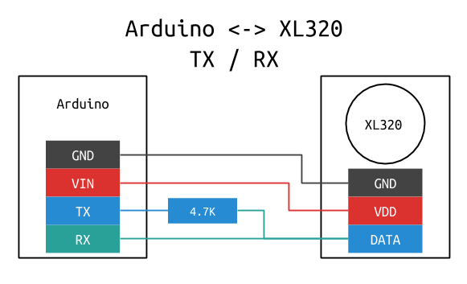

woo-xl320
=========

This repository provides drivers to command xl320 servos through Arduino.

You have 3 possible ways:

1. Use the arduino librarie XL320 to control servos directly from your own Arduino Sketch.
2. Use the arduino sketch XLCMD/commander and transform your arduino into a serial terminal to commands the servos.
3. Use the host library to send command to arduino and use a sktech to change your arduino into a serial bridge.

This project is based on:

* Project github : hackerspace-adelaide/XL320
* [Robotis documentation](http://support.robotis.com/en/product/actuator/dynamixel_pro/communication.htm)

Arduino Sketch and Libraries
----------------------------

To learn more about Arduino libraries go in the [arduino directory](arduino/README.md)

Wiring
------

Here are the pins of the servos:


You can choose to just connect the serial TX wire to just send command to servo.


If you also want to read servo registers you have to connect the serial RX too. But XL320 servo provides only 1 wire for data so you have perform a micro-hack.



I have choosen to plug VDD of servo to VIN of Arduino to be able to power up servo with more than 5V. Indeed VIN provides the voltage of the USB (5V) if the USB is the only source. But If you also plug an external alimentation, 9V for example, VIN will provide 9V.

Build the host library
----------------------

Easy with cmake

```bash
ls
# woo-xl320
mkdir build
ls
# woo-xl320     build
cd build
../woo-xl320/xcmake.sh ../woo-xl320
make
```

Use the host library
--------------------


